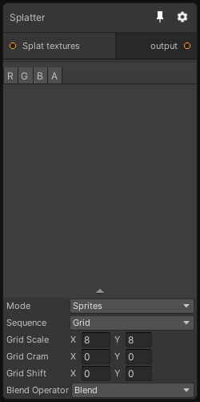

# Splatter

## Inputs
Port Name | Description
--- | ---
Splat textures | 

## Output
Port Name | Description
--- | ---
output | 

## Description
Distribute a set of input textures based on parameter-based patterns.
Most of the settings of this node are available in the inspector so don't hesitate to pin the node and tweak the parameters until you achieve your goal.

Note that when you connect multiple textures in the "Splat Textures" port, they will be randomly selected at each splat operation.
The limit of different input textures you can connect is 16, after new textures will be ignored.

When you generate the tiles, you can also choose to output the UVs of the tiles using the channel mode in the inspector, this can be useful to generate a noise based on these UVs.

For combining height based tiles, please use the **Height Tile** mode, this special mode will automatically combine the tiles based on their depth with a Z-Buffer.
All input height maps must use data > 0, every height value <= 0 will be discarded.
In **Height Tile** mode, this node will output in RG the UVs of the tiles, in B the height of the tile and in A a random value between 0 and 1.
Note that to keep the depth buffer precision correct, the current max depth of a tile (value in texture + position in  the z axis) is clamped between -10000 and +10000.

